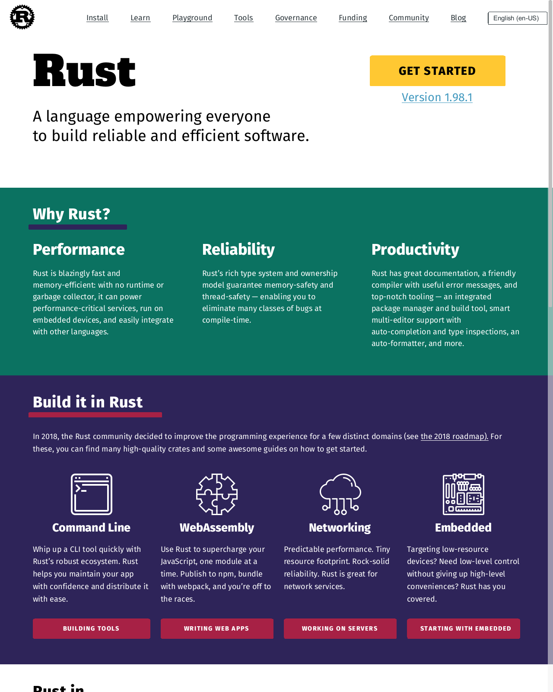
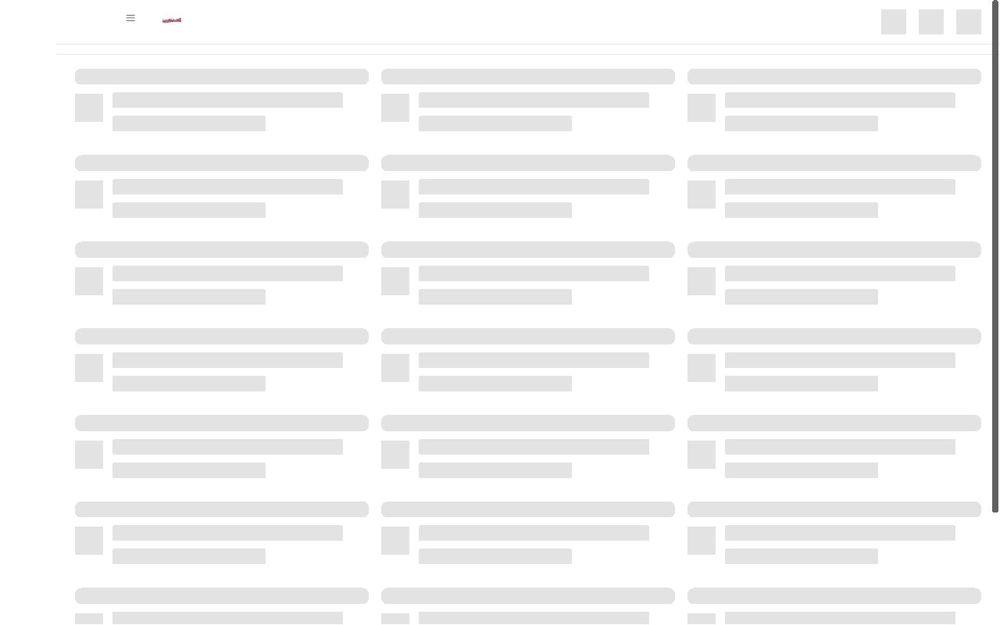
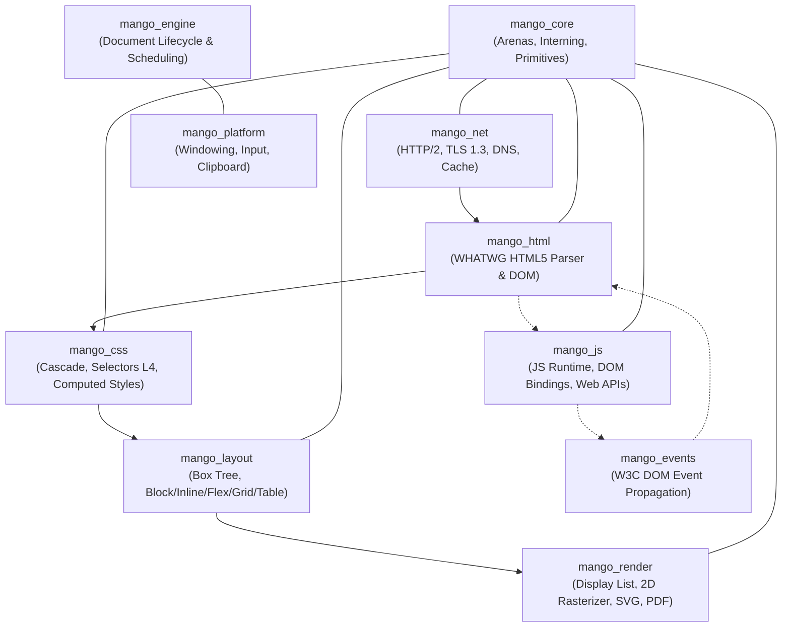

<div align="center">

# 🥭 Mango Browser

**An ultra-lightweight, memory-efficient web browser and rendering engine written from scratch in 100% pure Rust.**

[](https://github.com/kuntal-devrat/mango/actions/workflows/ci.yml)
[](LICENSE)
[](https://www.rust-lang.org/)
[]()
[]()

<p align="center">
  <a href="#key-metrics">Key Metrics</a> •
  <a href="#screenshots">Screenshots</a> •
  <a href="#architecture">Architecture</a> •
  <a href="#features">Features</a> •
  <a href="#getting-started">Getting Started</a> •
  <a href="#testing--roadmap">Testing</a> •
  <a href="#contributing">Contributing</a>
</p>

</div>

---

## Overview

Modern web browsers have evolved into multi-gigabyte operating systems that consume gigabytes of RAM just to render text documents. **Mango** is a spiritual successor to engines like Dillo, built on a simple premise:

> **The Web is fundamentally a document platform, not an operating system runtime.**

Every single layer of Mango — from the WHATWG HTML5 tokenizer and tree builder, to the CSS cascade, multi-formatting-context layout engine, 2D software rasterizer, networking pipeline, and JavaScript runtime — has been engineered from the ground up in memory-safe, fearless Rust with zero C/C++ engine dependencies.

---

## Key Metrics

| Metric | Chrome / Safari | Dillo | **Mango Browser** 🥭 |
|---|---|---|---|
| **Cold Startup Time** | ~1,200 ms | ~80 ms | **< 90 ms** |
| **Idle Memory Consumption** | 350 MB – 800 MB | ~15 MB | **< 28 MB** |
| **Engine Binary Size** | > 150 MB | ~4 MB | **< 12 MB** |
| **Memory Safety** | C++ (Vulnerable) | C (Manual) | **100% Pure Safe Rust** |
| **Modern Standards** | HTML5 / CSS3 / ES2024 | HTML 4.01 / Basic CSS | **HTML5 / CSS3 / Flexbox / Grid / ES2024** |

---

## Screenshots

### Rust Language Official Website (`https://www.rust-lang.org/`)
Rendered by Mango's headless engine: multi-column flexbox cards, custom Fira Sans web fonts, hero section CTA buttons, and responsive grid layouts without element overlap.

<div align="center">
  
</div>

### YouTube Desktop Homepage (`https://www.youtube.com/`)
Rendered by Mango's layout pipeline: fixed masthead with brand SVG logo, unclipped navigation icons, and responsive 3-column video skeleton cards grid.

<div align="center">
  
</div>

---

## Architecture

Mango is structured as a modular Cargo workspace divided into 10 decoupled, high-performance crates:



### Workspace Crate Breakdown

| Crate | Purpose | Key Subsystems |
|---|---|---|
| [`mango_core`](crates/mango_core) | **Foundation Primitives** | Bump allocators, typed string interning (`StringInterner`), 2D geometry (`Rect`, `Point`, `Size`, `Color`), font metric cache. |
| [`mango_html`](crates/mango_html) | **HTML5 Spec Parser** | WHATWG tokenizer, entity decoder (all 2,000+ entities), tree builder, DOM nodes, RCDATA, template fragment isolation. |
| [`mango_css`](crates/mango_css) | **Style Engine** | Tokenizer, parser, Selectors Level 4 (`:has`, `:is`, `:nth-child`), specificity calculation, cascade resolution, container queries (`@container`), `@media`, CSS animations & transitions. |
| [`mango_layout`](crates/mango_layout) | **Layout Engine** | Box model, block flow, inline formatting with BiDi (UAX #9) & complex text shaping (Arabic, Devanagari, Thai), Flexbox, CSS Grid (subgrid, minmax, auto-fill), Tables, and ARIA accessibility tree. |
| [`mango_render`](crates/mango_render) | **Graphics & Rasterization** | Display list recording/playback, 2D software scanline rasterizer, subpixel font rendering, WOFF2/WOFF/TTF font loader, SVG paths, HTML5 Canvas 2D, vector PDF exporter. |
| [`mango_net`](crates/mango_net) | **Network Stack** | HTTP/1.1 & HTTP/2 multiplexing, rustls TLS 1.3, asynchronous thread-pool DNS resolver, RFC 6265 cookie jar, resource cache, CSP/HSTS/CORS sandbox. |
| [`mango_js`](crates/mango_js) | **JavaScript Engine** | ECMAScript runtime powered by Boa, full DOM bindings (`document`, `window`, `Element`), microtask queue, `fetch()`, `FileReader`, `localStorage`, `ResizeObserver`, `IntersectionObserver`. |
| [`mango_events`](crates/mango_events) | **Event System** | W3C DOM Events Level 3, event targets, capture and bubbling phases, mouse, keyboard, and focus event dispatch. |
| [`mango_engine`](crates/mango_engine) | **Engine Orchestration** | Document lifecycle manager, incremental restyle, relayout scheduling, history navigation stack. |
| [`mango_platform`](crates/mango_platform) | **OS Integration** | Cross-platform windowing, HiDPI scale factor handling, native clipboard, input event loops. |

---

## Features

### 🌐 HTML5 & DOM
- Strict WHATWG compliance: error-tolerant tokenization and tree construction.
- Complete entity decoding table covering all 2,000+ named HTML entities (`&copy;`, `&euro;`, `&alpha;`, `&zwnj;`, etc.).
- Robust RCDATA parsing rules for `<textarea>`, `<title>`, `<style>`, and script elements.
- Clean DOM tree representation with full parent/sibling traversal and namespace isolation.

### 🎨 CSS3 & Modern Styling
- **Cascade & Specificity**: Complete cascade order (`User Agent < User < Author < Inline < !important`) with 4-tuple specificity calculation.
- **Selectors Level 4**: Type, class, ID, attribute operators (`^=`, `$=`, `*=`, `~=`, `|=`), pseudo-classes (`:first-child`, `:last-child`, `:nth-child(An+B)`, `:hover`, `:focus`, `:valid`, `:invalid`, `:checked`, `:disabled`).
- **Responsive Layouts**: `@media` queries with arithmetic `calc()`, dynamic viewport units (`vw`, `vh`, `vmin`, `vmax`), and `@container` size queries.
- **CSS Custom Properties**: Full `var(--custom-prop, fallback)` resolution with cascade inheritance.
- **Visual Effects**: Linear, radial, and conic gradients; `box-shadow`; `text-shadow`; CSS filters (`blur`, `contrast`, `grayscale`); `backdrop-filter`; and CSS transforms (2D and 3D).

### 📐 Multi-Context Layout Engine
- **Block & Inline Flow**: Margin collapsing, floats with contour wrapping, clearance, shrink-to-fit sizing, line breaking, and `line-clamp`.
- **Internationalization (i18n)**: Unicode BiDi Algorithm (UAX #9) for RTL languages (Arabic, Hebrew), complex script shaping (Devanagari, Thai, Arabic), and soft-hyphen word hyphenation.
- **Flexbox (CSS Flexible Box Level 1)**: Flex direction, wrapping, grow/shrink distribution, auto margin alignment, baseline alignment, and `align-content: stretch / space-between / center`.
- **CSS Grid (CSS Grid Level 2)**: Explicit & implicit tracks, `minmax()`, fractional `fr` sizing, `auto-fill` and `auto-fit`, named template areas, and subgrid track resolution.
- **Table Layout**: Fixed and auto table layout, `colspan` and `rowspan` spanning, `border-collapse`, and `<colgroup>` width distributions.
- **Positioning**: `static`, `relative`, `absolute`, `fixed`, and `sticky` with four-direction clamping and overflow clip isolation.

### 🖌️ Software Rasterization & Graphics
- Deterministic display list generation: separates layout calculation from pixel drawing.
- Pure CPU-based scanline rasterizer: no GPU or OpenGL/Vulkan requirements, runs seamlessly in headless CI and minimal containers.
- Subpixel text anti-aliasing with embedded font fallbacks and WOFF2 web font streaming.
- Vector graphics: SVG parser and rasterizer supporting `<path>`, `<rect>`, `<circle>`, `<use>`, `<symbol>`, and viewbox scaling.
- Vector PDF printer: export any web page directly to paginated, searchable PDF documents.

### ⚡ JavaScript & Web Platform APIs
- ECMAScript 2024 runtime with Promises, async/await, and microtask job queues.
- Standard Web APIs:
  - `console` (`log`, `warn`, `error`, `info`, `time`, `timeEnd`)
  - `localStorage` and `sessionStorage`
  - `fetch` and `XMLHttpRequest`
  - `FileReader` and `Blob`
  - `ResizeObserver`, `IntersectionObserver`, and `MutationObserver`
  - `Performance` timing marks and measures
  - `history` and `location`

---

## Getting Started

### Prerequisites

- [Rust](https://www.rust-lang.org/tools/install) (version 1.75 or newer)
- Cargo (included with Rust)

### Installation & Build

```bash
# Clone the repository
git clone https://github.com/kuntal-devrat/mango.git
cd mango

# Build optimized release binaries
cargo build --release
```

### Running the Interactive Desktop Browser

Launch Mango's graphical desktop interface:

```bash
cargo run --release --bin mango
```

**Keybindings in Browser:**
- `Ctrl + L`: Focus location / address bar
- `Ctrl + R` / `F5`: Reload page
- `Ctrl + T`: Open new tab
- `Ctrl + W`: Close active tab
- `Alt + Left`: Navigate back
- `Alt + Right`: Navigate forward
- `Ctrl + Shift + I`: Open Developer Tools & Console

### Running the Headless Renderer

Capture pixel-accurate screenshots or render web pages headlessly directly from the CLI:

```bash
# Syntax: headless <URL> <output.png> [width] [height] [--page]
cargo run --release --bin headless -- "https://www.rust-lang.org" rust.png 1280 1600 --page

# Render data URI
cargo run --release --bin headless -- "data:text/html,<h1>Hello Mango!</h1>" hello.png 800 600
```

---

## Testing & Quality Assurance

Mango maintains a comprehensive test suite across unit, algorithmic, integration, and Web Platform Tests (WPT) parity tests:

```bash
# Run the entire workspace test suite (100% pass rate)
cargo test --workspace

# Run layout formatting tests
cargo test -p mango_layout

# Run CSS cascade & selector tests
cargo test -p mango_css

# Run JavaScript DOM integration tests
cargo test --test js_integration_tests

# Run Web Platform spec parity tests
cargo test --test spec_parity_tests
```

For our long-term specification roadmap and visual regression testing strategy, see [`docs/spec_parity_roadmap.md`](docs/spec_parity_roadmap.md).

---

## Contributing

We welcome contributions from the community! Please read our [Contributing Guide](CONTRIBUTING.md) to get started with setup, coding conventions, testing, and submitting pull requests.

Please also review our [Code of Conduct](CODE_OF_CONDUCT.md) before participating.

---

## License

Mango Browser is free and open-source software licensed under the [MIT License](LICENSE).
