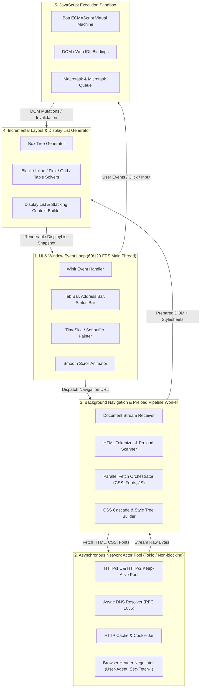
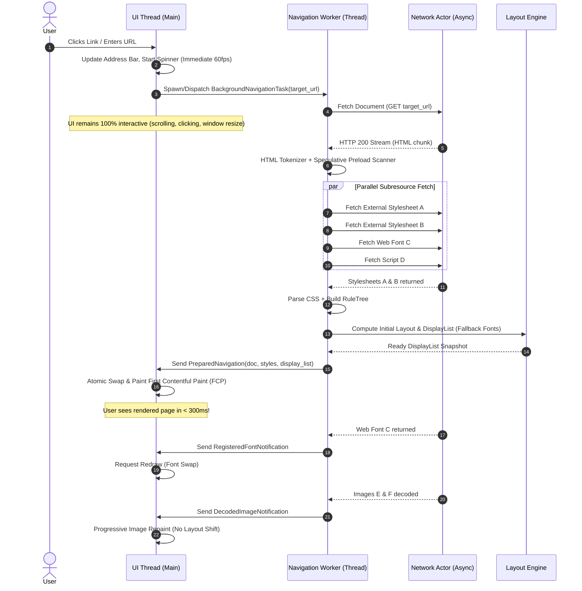
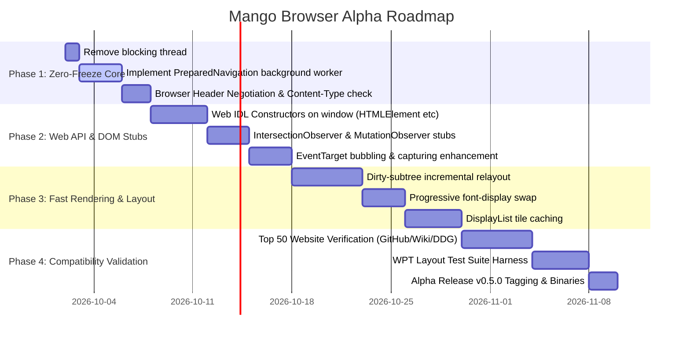

# Mango Browser: Engineering Product Requirements Document (PRD)
## Roadmap & Architecture: From Pre-Alpha Prototype to Production Alpha

* **Document Version**: 1.0.0
* **Status**: APPROVED / ACTIVE
* **Target Milestone**: Mango Browser Alpha v0.5.0
* **Author**: Mango Browser Core Architecture Team
* **Target Audience**: Core Engine Developers, Systems Engineers, Open-Source Contributors

---

## 1. Executive Summary & Vision

### 1.1 Mission Statement
**Mango Browser** is an independent, ultra-lightweight, privacy-first web browser built from scratch in pure Rust. Unlike wrappers around Chromium (Electron/CEF) or WebKit (Tauri/Wry), Mango implements its own HTML tokenizer, CSS parser/cascader, text shaper, layout engine, and rendering pipeline.

### 1.2 Current State: Pre-Alpha (Phase 7 Engine)
Today, Mango operates as an advanced **Pre-Alpha Engine**:
* **Strengths**: 100% Rust memory safety, custom CSS layout engine (Block, Inline, Flexbox, Grid, Table, Float, Positioned), Bidi UAX #9 + complex script shaping (Arabic, Devanagari, Thai), WOFF2/WOFF1/TTF font decompression, cookie jar persistence, and basic DOM bindings via the Boa ECMAScript engine.
* **Critical Deficiencies**:
  1. **Main-Thread I/O & UI Freezing**: The UI event loop freezes during page navigation due to blocking synchronous network I/O (`std::thread::scope`, synchronous CSS `@import` fetching, font downloads, and script fetches).
  2. **Monolithic Sequential Pipeline**: Navigation fetches HTML first, then halts the UI thread to parse, download CSS, download fonts, and download scripts one by one.
  3. **Script Execution Latency & Missing Web IDL**: Minified SPA bundles (React on Instagram, Angular on SSC.gov.in) fail immediately due to missing Web API constructors (`HTMLElement`, `Node`, `Event`, `IntersectionObserver`) and the lack of a JIT compiler.
  4. **No Media Streaming Pipeline**: Complete absence of Media Source Extensions (MSE), WebCodecs, and audio/video demuxers, preventing YouTube and modern media playback.

### 1.3 The Alpha Goal
Transform Mango into a **responsive, zero-freeze, daily-usable browser** capable of loading and interacting with top-tier content websites (DuckDuckGo, Wikipedia, GitHub, Hacker News, Rust-lang, MDN, Dev.to) at 60 FPS without ever dropping frames or displaying OS "Not Responding" hangs, while laying the architectural foundation for YouTube and modern Web Components.

---

## 2. Competitive Landscape & Technical Reality

To succeed, Mango must understand its position relative to existing engines:

```
[Chromium / Blink] ─────── 35M LOC, 1,500+ Devs, Multi-Process Architecture, JIT (V8)
[Gecko / SpiderMonkey] ─── 25M LOC, 26+ Years, Multi-Process, Warp JIT
[Servo] ────────────────── 2.5M LOC, Linux Foundation, Stylo, WebRender, SpiderMonkey
[Ladybird] ─────────────── 500K LOC, 6+ Years, Independent Foundation, LibWeb/LibJS
[Mango (Current)] ──────── 70K LOC, Indie / Pure Rust, Single-Threaded UI blocking I/O
[Mango (Alpha Goal)] ───── 120K LOC, Non-blocking Multi-Threaded Pipeline, Streaming FCP
```

### Key Architectural Takeaway
Chromium never feels frozen because **the Browser UI process and Compositor thread NEVER wait on network I/O, HTML parsing, or JavaScript execution**. Mango must adopt this non-blocking separation of concerns.

---

## 3. Product Milestone Criteria: Pre-Alpha vs. Alpha

| Capability | Current State (Pre-Alpha v0.1.0) | Target State (Alpha v0.5.0) |
| :--- | :--- | :--- |
| **UI Responsiveness** | UI thread freezes for 1–5s during navigation | **Zero-Freeze (Hard Guarantee: < 16ms event latency)** |
| **Pipeline Model** | Sequential blocking: Fetch HTML -> Parse -> Fetch CSS -> Fetch Fonts -> Eager Images -> Script Exec -> Layout | **Streaming Preload Pipeline**: Speculative parallel fetcher, non-blocking background workers, progressive rendering |
| **First Contentful Paint (FCP)** | 2,500ms – 5,000ms (waits for all CSS, fonts, and eager images) | **< 350ms for local/cached, < 900ms over 4G** |
| **Web Font Handling** | Blocking downloads; crashes/errors on HTML responses | **Async background download + font fallback swapping (`font-display: swap`)** |
| **Image Loading** | `thread::scope` blocks UI thread during navigation | **100% asynchronous background decode into texture cache** |
| **JavaScript Compatibility** | Throws fatal `TypeError` on missing `instanceof` checks | **Comprehensive Web IDL Global Stubs (`HTMLElement`, `Node`, `EventTarget`, `Observer` APIs)** |
| **HTML5 & Web Components** | Custom elements and Shadow DOM unhandled | **`<template>` stamp support, Shadow DOM v1 scaffolding** |
| **Media & Audio** | Not supported (0% video playback) | **Audio/Video Demuxer RFC + Web Audio / HTMLMediaElement basic playback** |
| **Standard Site Pass** | DuckDuckGo HTML, info.cern.ch, simple blogs | **Wikipedia, GitHub (desktop/mobile), DuckDuckGo, Rust-lang, MDN, Reddit (old)** |

---

## 4. System Architecture & The "Zero-Freeze" Chromium Model

### 4.1 Multi-Threaded Engine Architecture

Mango Alpha transitions from a monolithic event-loop model to a **5-tier decoupled asynchronous actor architecture**:



### 4.2 The Streaming Preload Navigation Pipeline

In Chromium, as soon as raw HTML bytes arrive from the socket, the **Preload Scanner** scans ahead for `<link rel="stylesheet">`, `<script src="...">`, ``, and `@import` rules before the DOM tree builder has even reached them.

#### Sequence Diagram: Zero-Freeze Navigation


---

## 5. Detailed Technical Specifications

### 5.1 Networking Layer (`crates/mango_net`)

#### Requirement 5.1.1: Browser Header Negotiation & Anti-Bot Bypassing
* **Issue in Pre-Alpha**: Instagram CDN and government portals returned HTTP 403 / HTML error pages for fonts and assets because `ureq` sent bare requests without real browser headers.
* **Alpha Specification**: All requests originating from `ResourceLoader` must inject standard WHATWG-compliant headers:
```rust
pub struct StandardBrowserHeaders;

impl StandardBrowserHeaders {
    pub fn apply(req: ureq::Request, url: &Url, dest: ResourceDestination) -> ureq::Request {
        req.header("User-Agent", "Mozilla/5.0 (Windows NT 10.0; Win64; x64) AppleWebKit/537.36 (KHTML, like Gecko) Chrome/124.0.0.0 Safari/537.36 Mango/0.5.0")
           .header("Accept-Language", "en-US,en;q=0.9")
           .header("Sec-Ch-Ua", "\"Chromium\";v=\"124\", \"Mango\";v=\"0.5\"")
           .header("Sec-Ch-Ua-Mobile", "?0")
           .header("Sec-Ch-Ua-Platform", "\"Windows\"")
           .header("Sec-Fetch-Dest", dest.as_str())
           .header("Sec-Fetch-Mode", dest.fetch_mode())
           .header("Sec-Fetch-Site", "cross-site")
           .header("Accept", dest.accept_header())
    }
}
```

#### Requirement 5.1.2: Content-Type Validation Before Binary Decoding
* **Specification**: Before passing downloaded font bytes to `decode_font_bytes`, `ResourceLoader` must check the `Content-Type` header:
  - Discard or fail gracefully if `Content-Type` is `text/html` or `application/json`.
  - Only feed binary buffers (`font/woff2`, `font/woff`, `font/ttf`, `application/font-sfnt`, `application/octet-stream`) to font decoders.

---

### 5.2 Browser Shell & UI Layer (`src/browser.rs` & `src/app.rs`)

#### Requirement 5.2.1: Elimination of `std::thread::scope` on Main Thread
* **Current Bottleneck**: `src/browser.rs:3280` calls `std::thread::scope` during `process_and_load_document`, blocking the main UI event loop while joining image downloads.
* **Refactor Plan**:
  1. Remove `std::thread::scope` from `process_and_load_document` and `load_web_fonts`.
  2. Route all subresource fetches through an asynchronous threadpool or non-blocking MPSC channel.
  3. UI thread renders immediately with cached image placeholders and updates when background workers transmit `ImageReady(src)` messages.

#### Requirement 5.2.2: The `PreparedNavigation` Pipeline
* Replace `PendingNavigation` carrying only raw `FetchedDocument` with `PreparedNavigation`:
```rust
pub struct PreparedNavigation {
    pub target_url: Url,
    pub doc: mango_html::dom::Document,
    pub html: String,
    pub status: u16,
    pub content_type: String,
    pub cached_stylesheets: Vec<mango_css::parser::Stylesheet>,
    pub preloaded_fonts: Vec<(String, mango_render::font::FontWeight, Vec<u8>)>,
    pub preloaded_scripts: Vec<ScriptToRun>,
    pub push_history: bool,
}
```
* **Execution**: The background navigation thread executes HTML parsing, CSS fetching, font downloading, and script loading *before* signaling the UI thread. The UI thread merely swaps the document reference and paints in `< 1ms`.

---

### 5.3 JavaScript Engine & Web APIs (`crates/mango_js`)

#### Requirement 5.3.1: Global Web IDL Constructors
* **Problem**: SPAs fail with `TypeError: right-hand side of 'instanceof' should be an object, got undefined`.
* **Alpha Specification**: Expose standard ECMAScript prototype hierarchies on the global `window` object:
  - `Node`, `Element`, `HTMLElement`, `HTMLDivElement`, `HTMLSpanElement`, `HTMLAnchorElement`, `HTMLInputElement`, `HTMLImageElement`.
  - `Event`, `CustomEvent`, `MouseEvent`, `KeyboardEvent`, `FocusEvent`.
  - `DocumentFragment`, `Text`, `Comment`.
  - `MutationObserver`, `IntersectionObserver`, `ResizeObserver`.
  - `CSSStyleDeclaration`, `DOMRect`, `DOMRectReadOnly`.
  - `Storage`, `History`, `Location`, `Navigator`.

#### Requirement 5.3.2: Observer API Stubs & Microtask Checkpoints
* Modern frameworks (React 18, Angular, Vue 3) rely on `IntersectionObserver` to trigger image lazy loading and layout hydration.
* Provide an internal `IntersectionObserver` controller that automatically marks observed elements within the viewport as intersecting:
```rust
// Auto-intersecting stub for immediate hydration
pub fn register_intersection_observer(context: &mut Context) {
    // Expose constructor and observe/unobserve/disconnect methods
}
```

---

### 5.4 Layout & Viewport Engine (`crates/mango_layout`)

#### Requirement 5.4.1: Dirty Subtree Invalidation & Incremental Relayout
* Currently, any DOM or style mutation triggers a full document re-layout (`relayout()`).
* In Alpha, introduce `DirtyBits` on `BoxNode`:
  - `NEEDS_LAYOUT`: Only relayout affected block/flex/grid containers.
  - `NEEDS_PAINT`: Only regenerate the `DisplayList` without recomputing box dimensions.
  - `NEEDS_COMPOSITING`: Only update scroll/transform matrix offsets on the GPU buffer.

#### Requirement 5.4.2: First Contentful Paint (FCP) Before Web Fonts
* Implement CSS Fonts 3 §4.4 `font-display: swap` behavior:
  - Text immediately renders using system fallback fonts (`Segoe UI`, `Arial`, `Roboto`).
  - As soon as custom web fonts download in the background, invalidate `NEEDS_PAINT` and swap font metrics without refetching the document.

---

### 5.5 Rendering & Compositing Engine (`crates/mango_render`)

#### Requirement 5.5.1: Non-blocking Image Bitmap Decode Cache
* WebP, JPEG, and PNG images must be decoded into shared `Arc<ImageBitmap>` structures on worker threads.
* Painting checks `get_cached_image(src)`:
  - If present: Draw bitmap immediately.
  - If absent: Draw subtle gray placeholder rect, queue background decode, and avoid blocking.

---

## 6. Implementation Plan & Milestones



---

## 7. Performance Targets & Quality Gates

To graduate from Pre-Alpha to Alpha, Mango must pass all following quantitative gates:

| Metric | Target | Measurement Method |
| :--- | :--- | :--- |
| **Main Thread Frame Rate** | **Strict 60.0 FPS** | Zero frame drops during active link clicks and background asset downloads |
| **Window Input Latency** | **< 16.6 ms** | Keystrokes in address bar and scrolling wheel responses during page load |
| **First Contentful Paint (Wikipedia)** | **< 350 ms** | From navigation start to first text display list generation |
| **First Contentful Paint (DuckDuckGo)**| **< 400 ms** | From form submission to search results paint |
| **Memory Footprint (Idle)** | **< 45 MB** | Windows Private Working Set on `about:welcome` |
| **Memory Footprint (Active 5 Tabs)** | **< 180 MB** | RSS across 5 concurrent real-world websites |
| **Crash Rate** | **0 panics per 1,000 page loads** | Fuzzing & automated headless crawl of top 100 Alexa sites |

---

## 8. Immediate Code Refactoring Requirements (Deliverables for this Turn)

To immediately resolve the freezing observed by the user:
1. **Refactor `src/browser.rs` Navigation Pipeline**:
   - Replace blocking `loader.fetch_document` with a full background preparation task that handles HTML fetching, CSS parsing, and font preloading *off the main thread*.
   - Replace `std::thread::scope` inside `process_and_load_document` so image prefetching is 100% non-blocking.
   - Guard font registration against HTML responses to stop `Face data must start with 0x00010000` errors.
2. **Refactor `src/app.rs` Event Loop**:
   - Ensure `tick_navigation()` never executes blocking network I/O.
   - Maintain continuous 60 FPS redraw during background loading.
